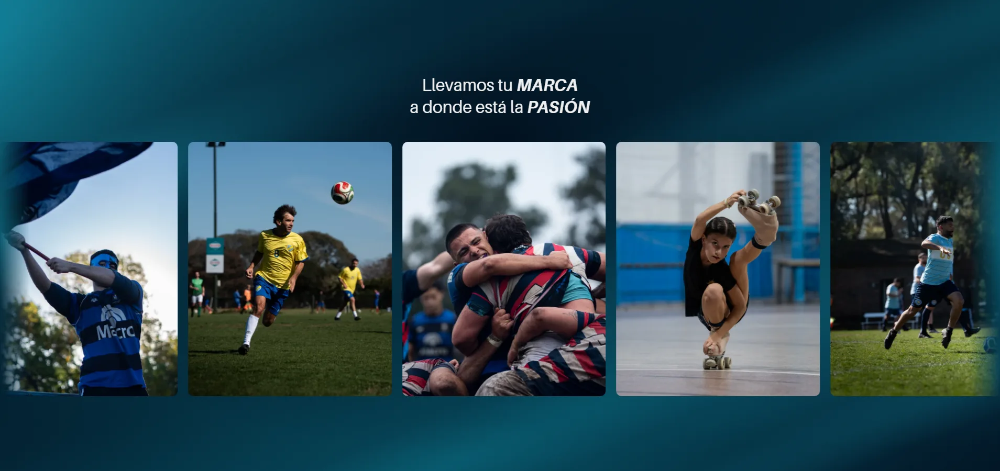

# Unodosmil

Sitio de **Unodosmil**, agencia de fotografía y video (Rosario, Argentina).

## Observar web en tu máquina

Necesitás Node.js 20 o superior.
```bash
git clone https://github.com/ManuelBausela1/Unodosmil.git
cd Unodosmil
npm install
npm run dev
```

Queda en `localhost:5173`.

## Estructura

Cada componente es una carpeta con su JSX, su hoja de estilos y un `index.js`
que lo reexporta. Los estilos viven al lado del componente que los usa: nunca
hay que buscar en un CSS global para entender por qué algo se ve como se ve.

```
src/
├── assets/
│   ├── images/hero/       recortes 4:5 de las fotos
│   └── logos/
├── components/            componentes reutilizables
│   ├── AmbientBackground/ malla de ondas: el fondo de toda la página
│   ├── PhotoCarousel/     carrusel infinito de fotos
│   ├── PhraseRotator/     frases que rotan con fundido cruzado
│   └── WhatsappButton/    CTA a WhatsApp
├── data/
│   ├── fotos.js           fotos + textos alt
│   └── site.js            datos, frases y armado del link de WhatsApp
├── hooks/
│   └── useMediaQuery.js
├── pages/
│   └── Home/
│       ├── Home.jsx
│       └── sections/      una carpeta por sección de la landing
│           ├── Hero/
│           └── Galeria/
├── styles/
│   ├── tokens.css         colores, tipografías, espaciados, curvas de easing
│   ├── reset.css
│   └── global.css         punto de entrada: fuentes + tokens + reset + base
├── App.jsx
└── main.jsx
```

Fuera de `src/`:

```
public/media/              el video del hero y su póster
scripts/optimize-assets.mjs   genera las fotos web desde ../contenido
scripts/optimize-video.mjs    comprime el video del hero
docs/                      capturas para este README
```

---

# Secciones

## El fondo, que es de todas

`components/AmbientBackground`

Una malla de ondas en el petróleo de marca, montada **una sola vez** en
`App.jsx` y fija al viewport. Ninguna sección pinta su propio fondo: todas
scrollean por encima de ésta con fondo transparente.

Esa es la decisión que hace que el sitio se lea como una pieza continua y no
como bloques apilados — no hay costura posible entre secciones porque no hay dos
fondos que empalmar.

Son tres capas:

1. **Luz** — cinco degradados radiales en petróleo, con caída corta
   (`transparent` al 45%) para que se corten entre sí en un frente definido en
   vez de disolverse en una nube.
2. **Franjas** — elipses muy achatadas (72% de ancho por 11% de alto) que dan
   trazos largos en lugar de manchas redondas. Es lo que se lee como líneas.
3. **Sombra** — degradados en azul noche por encima de las otras dos. No agregan
   color: recortan el de abajo, y ese borde es la cresta de la onda.

Las tres rotan en sentidos opuestos a 34, 41 y 47 segundos. Los períodos no son
múltiplos entre sí, así que el patrón combinado tarda muchísimo en repetirse.

**Regla para las secciones nuevas:** no les pongas `background`. Si necesitan
contraste para su texto, usá un velo local que **vuelva a cero en los bordes**
— si termina con opacidad, marca un escalón contra la sección siguiente.

## Hero


Un video a pantalla completa, mudo y en bucle. La idea es abrir mostrando que la
agencia hace video y no sólo fotografía, y que el material hable antes que
cualquier texto.

**Los primeros tres segundos el video se ve solo**, sin nada encima: ni velo, ni
marca, ni botón. Recién entonces entra todo junto — la capa de contraste, el
logotipo con un desenfoque que se resuelve, la frase «Entendemos el juego»
palabra por palabra, y el botón de WhatsApp.

Ese orden es deliberado: cualquier cosa superpuesta desde el arranque le baja el
contraste al video, que es justamente lo que se quiere lucir.

Tres detalles que no son opcionales:

- **`muted`** — ningún navegador deja arrancar solo un video con sonido. Sin
  esto el autoplay se bloquea y queda el póster congelado.
- **`playsInline`** — sin esto iOS abre el video a pantalla completa en vez de
  reproducirlo dentro de la página.
- **El póster** es lo que se ve mientras carga, y lo único que reciben quienes
  pidieron reducir el movimiento: a ellos se les sirve la imagen fija.

El logotipo lleva su propia sombra porque sobre un fotograma claro el blanco
sobre blanco se pierde, y el velo solo no alcanza.

## Galería



Ocupa la pantalla entera en desktop, como el hero, para que las dos se lean como
dos planos de la misma pieza. En móvil crece con su contenido: forzar la altura
completa en una pantalla angosta apretaría las fotos hasta hacerlas ilegibles.

Arriba, dos frases que se alternan cada cuatro segundos con las palabras clave
en mayúscula e itálica. Las dos líneas de cada frase entran juntas, y las dos
frases están siempre en el HTML —sólo cambia cuál se ve— así el bloque no salta
de alto al rotar.

### El carrusel

`components/PhotoCarousel`

El bucle nunca se corta porque **la lista va duplicada** y la animación desplaza
la pista exactamente un 50%. Cuando la primera copia terminó de pasar, la pista
vuelve al origen — y como la segunda es idéntica, ese salto cae sobre un cuadro
visualmente igual y no se percibe.

La duración se calcula como `cantidad de fotos × segundos por foto`, no es un
número fijo: así la velocidad es la misma haya once fotos o treinta, en vez de
acelerarse cada vez que se agrega una.

**Al pasar el mouse la pista se frena y todas las fotos se apagan menos la
señalada**, que queda en su color pleno. El disparador es la foto y no el
contenedor, así que pasar por el hueco entre dos no detiene nada.

Las fotos se muestran lo bastante grandes como para apreciarlas sin abrirlas,
así que no son interactivas: son `` sueltas y no botones. Un control que no
lleva a ninguna parte sólo ensucia el recorrido del teclado y el de los lectores
de pantalla.

