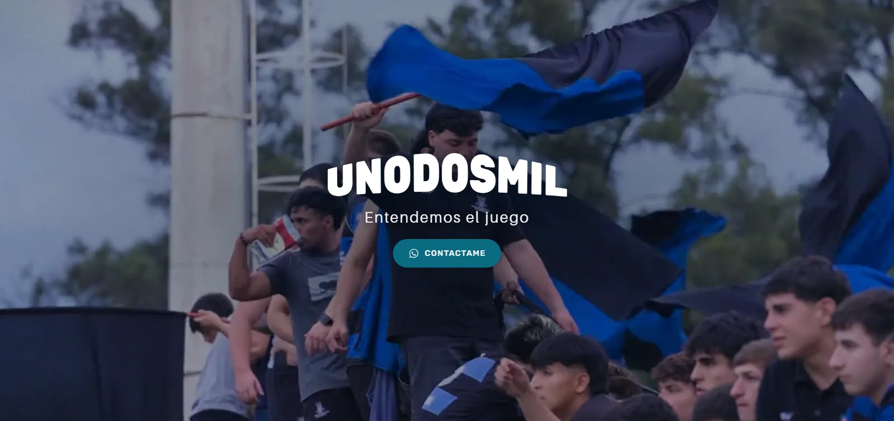

# Unodosmil

Sitio de **Unodosmil**, agencia de fotografía y video de deporte en movimiento
(Rosario, Argentina). React 19 + Vite. Una sola página.

El objetivo del sitio es convertir: que alguien que llega vea el nivel del
trabajo en los primeros dos segundos y termine escribiendo por WhatsApp.

## Arrancar

```bash
npm install
npm run dev
```

| Script            | Qué hace                                           |
| ----------------- | -------------------------------------------------- |
| `npm run dev`     | Servidor de desarrollo en `localhost:5173`.         |
| `npm run build`   | Build de producción en `dist/`.                     |
| `npm run preview` | Sirve el build para verificarlo antes de publicar.  |
| `npm run lint`    | oxlint sobre todo el proyecto.                      |
| `npm run assets`  | Regenera las imágenes web desde `../contenido`.     |

## Estructura

Cada componente es una carpeta con su JSX, su hoja de estilos y un `index.js`
que lo reexporta. Los estilos viven al lado del componente que los usa: nunca
hay que buscar en un CSS global para entender por qué algo se ve como se ve.

```
src/
├── assets/
│   ├── images/hero/       recortes 4:5 livianos del corredor del hero
│   └── logos/
├── components/            componentes reutilizables
│   ├── ImageStreamHero/   corredor de fotos en perspectiva 3D
│   ├── PhraseRotator/     frases que rotan con fundido cruzado
│   └── WhatsappButton/    CTA a WhatsApp
├── data/
│   ├── fotos.js           fotos del hero + textos alt
│   └── site.js            datos, frases del hero y armado del link de WhatsApp
├── hooks/
│   └── useMediaQuery.js
├── pages/
│   └── Home/
│       ├── Home.jsx
│       └── sections/      una carpeta por sección de la landing
│           └── Hero/
├── styles/
│   ├── tokens.css         colores, tipografías, espaciados, curvas de easing
│   ├── reset.css
│   └── global.css         punto de entrada: fuentes + tokens + reset + base
├── App.jsx
└── main.jsx
```

---

# Secciones

## Hero



Ocupa la pantalla completa. La idea es que la primera impresión sea el trabajo
de la agencia y no un texto describiéndolo: las fotos entran desde el fondo y
pasan al lado del visitante, como si estuviera parado en el medio del juego.

Se compone de cuatro capas, de atrás hacia adelante.

### 1. El corredor de fotos

`components/ImageStreamHero`

Dos rieles de fotos que viajan desde el punto de fuga hacia la cámara. No hay
librería 3D: es perspectiva CSS y una animación por card. A medida que una card
se acerca crece **y** se abre hacia el costado, porque la proyección escala la
posición y el tamaño con el mismo factor.

Toda la geometría se mide en `cqw` —porcentaje del ancho del contenedor— así que
el corredor mantiene sus proporciones en cualquier pantalla. En vertical usa un
juego de valores distinto: cards más grandes, más cantidad, y rieles que abren
más despacio.

### 2. El velo de contraste

`hero__scrim`

Tres degradados superpuestos. La regla es oscurecer sólo donde hay texto encima y
dejar la franja de fotos limpia — es lo que la agencia está vendiendo. Una elipse
detrás de la marca, un asiento abajo para el claim y el botón, y un filo angosto
en los laterales para que las fotos no se corten a pique contra el borde de la
ventana.

### 3. La marca

El logotipo curvo, que además es el único `<h1>` de la página: el nombre de la
agencia viaja en el `alt` de la imagen. Entra con un desenfoque que se resuelve.

Debajo, la frase institucional **«Entendemos el juego»**, en la tipografía de
texto y en gris tenue para no disputarle jerarquía al logotipo. Aparece palabra
por palabra: cada una vive dentro de una máscara que recorta, y el texto sube
desde abajo del borde — se asoma por debajo del logo en vez de aparecer.

### 4. El cierre

`components/PhraseRotator` + `components/WhatsappButton`

Debajo de las fotos rotan dos frases cada cinco segundos, con las palabras clave
en mayúscula e itálica:

> Llevamos tu **_MARCA_**
> a donde está la **_PASIÓN_**

> Tu **_PASIÓN_** merece
> ser vista por todos

Las dos líneas de cada frase entran juntas, como un bloque, porque dicen una sola
idea. Las dos frases están siempre en el HTML —sólo cambia cuál se ve— así el
bloque no salta de alto al rotar y un buscador las ve a las dos.

Cierra el botón a WhatsApp, en el petróleo de la marca, que vira al verde
original de WhatsApp al pasar el mouse.
